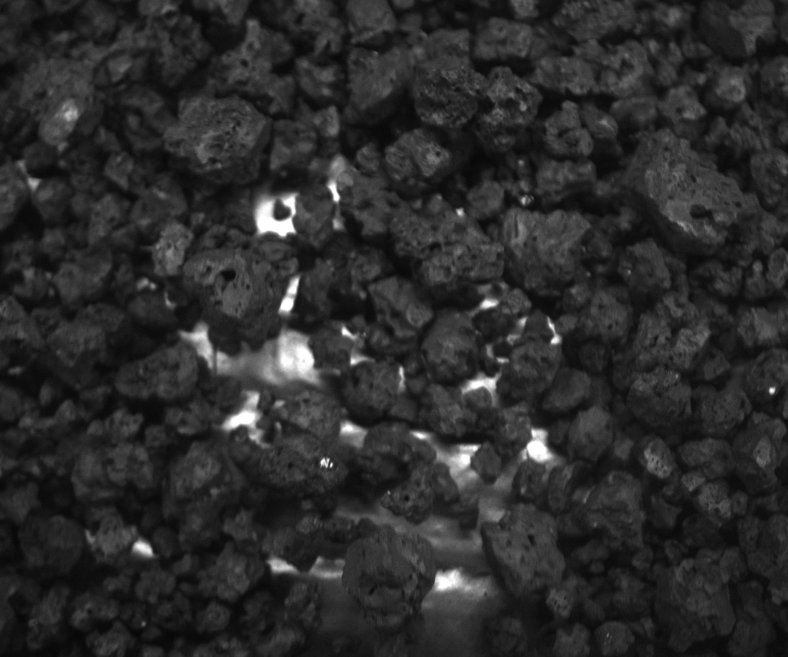
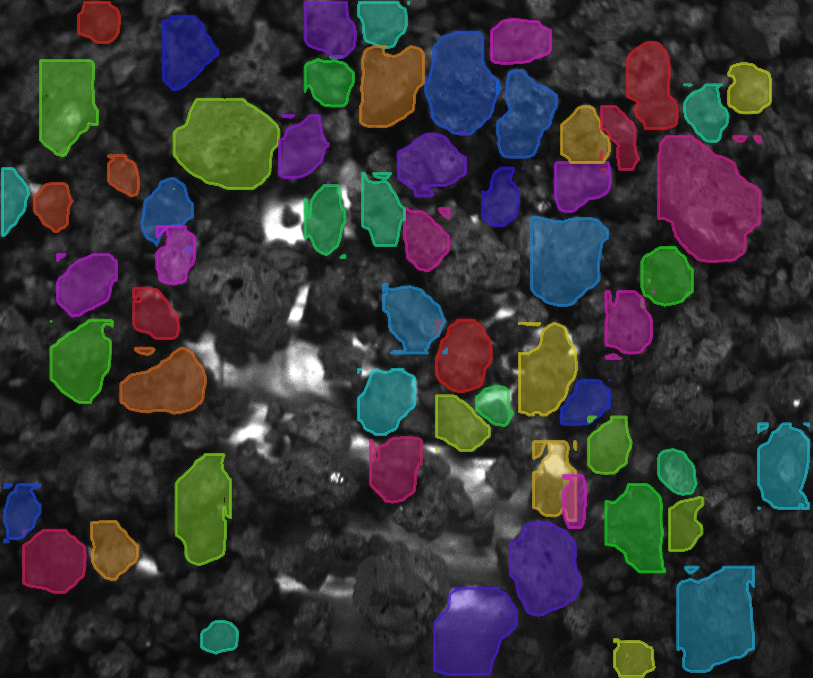

# D-FINE-seg — Segmentação de Instâncias (dataset *gran*)

Projeto análogo ao `yolov8-segmentation`, porém usando o framework
[**D-FINE-seg**](https://github.com/ArgoHA/D-FINE-seg) (detector DETR/D-FINE com cabeça
de máscara) no lugar do `ultralytics`.

O D-FINE-seg lê **o mesmo formato de labels** do YOLO de segmentação
(`classe x1 y1 x2 y2 ... xN yN`, normalizados), então o dataset **gran** é reaproveitado
diretamente.

## Exemplo

| Fonte (pré-segmentação) | Segmentação (pós) |
|:---:|:---:|
|  |  |

## Diferença em relação ao projeto YOLO

| | `yolov8-segmentation` | `dfine-segmentation` (este) |
|---|---|---|
| Backend | pacote pip `ultralytics` | repositório clonado + `uv` |
| Configuração | `config/dataset.yaml` | `config/config.yaml` (Hydra) |
| Execução | API Python direta | wrappers → `python -m src.dl.*` |
| Modelos | yolov8/11/26 *-seg* | D-FINE `n/s/m/l/x` |

Como o D-FINE-seg não é um pacote pip, os scripts daqui (`train.py`, `predict.py`,
`validate.py`, `export.py`) são camadas finas que localizam o clone do repositório,
sincronizam `config/config.yaml` e disparam os módulos correspondentes com overrides.

## Estrutura

```
dfine-segmentation/
├── config/
│   └── config.yaml          # config Hydra adaptada ao dataset gran (task: segment)
├── data/
│   ├── dataset/             # images/ + labels/ (gerado por prepare_data.py)
│   └── test/                # imagens para inferência
├── scripts/
│   ├── _download_dfine.py   # baixa o D-FINE-seg como zip (usado neste setup, sem git)
│   └── setup_dfine.ps1      # alternativa: clona via git + uv sync (mac/linux)
├── utils/
│   ├── dfine_runner.py      # ligação com o repo D-FINE-seg
│   └── prepare_data.py      # consolida o split YOLO no layout do D-FINE-seg
├── train.py                 # → src.dl.train
├── validate.py              # → src.dl.bench
├── predict.py               # → src.dl.infer
├── export.py                # → src.dl.export
└── requirements.txt
```

## Pipeline completa (WSL)

> **Por que WSL e não Windows nativo:** o `uv.lock` do D-FINE-seg só declara macOS e
> Linux como ambientes suportados (`tensorrt`/`onnxsim` são gated por plataforma), então
> `uv sync` **falha no Windows nativo**. Toda a pipeline roda dentro do **WSL2 (Ubuntu)**,
> onde a GPU/CUDA fica disponível via passthrough. O ambiente já foi instalado e validado
> (torch 2.9.1+cu128, `torch.cuda.is_available() == True`).

Os caminhos abaixo são os **desta máquina** (usuário Windows `MatheusBregonciPires`,
distro WSL `Ubuntu`). A pasta do projeto, vista de dentro do WSL, fica em
`/mnt/c/Users/MatheusBregonciPires/Projects/dfine-segmentation`.

### Passo 0 — Abrir o WSL

No **PowerShell** (ou no menu Iniciar → "Ubuntu"):

```powershell
# Lista as distros instaladas (deve aparecer "Ubuntu")
wsl -l -v

# Abre um shell interativo no Ubuntu
wsl -d Ubuntu
```

Ao entrar, você cai em `~` (`/home/matheusbregoncipires`). Vá para a pasta do projeto:

```bash
cd /mnt/c/Users/MatheusBregonciPires/Projects/dfine-segmentation
```

> Dica: para rodar um único comando sem abrir o shell, use
> `wsl -d Ubuntu -- bash -lic '<comando>'` direto do PowerShell.

### Passo 1 — Instalar o ambiente (uma vez)

```bash
# uv (gerenciador de ambiente) — pule se 'uv --version' já funcionar
curl -LsSf https://astral.sh/uv/install.sh | sh
source ~/.bashrc                                  # garante o uv no PATH

# (se a pasta D-FINE-seg/ não existir, baixe o framework como zip — não precisa de git)
python3 scripts/_download_dfine.py

# Cria o ambiente do framework em D-FINE-seg/.venv
cd D-FINE-seg
uv sync --python 3.11      # 3.11 evita compilar onnxsim (não há wheel p/ 3.13)
cd ..
```

`uv sync` baixa torch + CUDA + ~190 pacotes (alguns GB; ~10 min na 1ª vez). Os wrappers
detectam o clone `./D-FINE-seg` automaticamente (ou defina a env var `DFINE_HOME`).

### Passo 2 — Preparar o dataset

Reaproveita o dataset *gran* do projeto YOLO vizinho (mesmo formato de labels):

```bash
python3 utils/prepare_data.py --src ../yolov8-segmentation/data
```

Isso preenche `data/dataset/{images,labels}` e `data/test/`.

### Passo 3 — Gerar o split train/val

```bash
cd D-FINE-seg && uv run python -m src.etl.split && cd ..
```

### Passo 4 — Treinar / validar / inferir / exportar

```bash
# Treino
python3 train.py --model s --epochs 200 --batch 2 --workers 2 -- train.b_accum_steps=4 train.mask_batch_size=16 # Nesta máquina essa é a configuração ideal, visto que temos 6GB de VRAM.

# Validação / benchmark dos pesos treinados
python3 validate.py --exp-name exp

# Inferência sobre a pasta de teste
python3 predict.py --source data/test --exp-name exp --conf 0.5

# Inferência para os meus testes especificamente
python3 predict.py --source /mnt/c/Users/MatheusBregonciPires/Projects/dfine-segmentation/teste_dados_reais  --exp-name exp --conf 0.2


# Exportar para ONNX (ou tensorrt/openvino/coreml/litert)
python3 export.py --format onnx
```

Qualquer chave do `config.yaml` pode ser sobrescrita na linha de comando ao final
(sintaxe Hydra), por exemplo:

```bash
python3 train.py --model l --epochs 200 -- train.use_ema=False train.use_wandb=True
```

As saídas (modelos, predições de avaliação, visualizações) vão para `output/`.

### Pipeline em um comando (a partir do PowerShell)

```powershell
wsl -d Ubuntu -- bash -lic 'cd /mnt/c/Users/MatheusBregonciPires/Projects/dfine-segmentation && python3 utils/prepare_data.py --src ../yolov8-segmentation/data && (cd D-FINE-seg && uv run python -m src.etl.split) && python3 train.py --model s --epochs 150'
```

## Notas

- **Sem script de validação dedicado:** no D-FINE-seg a validação roda a cada época
  durante o treino (mAP/F1/IoU no split de validação). `validate.py` aqui chama o
  módulo de *benchmark* (`src.dl.bench`) para avaliar os pesos treinados. Para análise
  de falsos positivos/negativos use `uv run python -m src.dl.check_errors` no clone.
- **TensorRT** deve ser exportado no mesmo device (GPU) onde será usado.
- O `config.yaml` parte da configuração de referência do D-FINE-seg, ajustado para
  `task: segment`, classe única (`gran`), mosaic desativado (não recomendado para
  segmentação) e wandb desligado.

## Argumentos dos scripts

Todos os scripts são wrappers finos: traduzem as flags em overrides Hydra e disparam
o módulo correspondente do D-FINE-seg. Qualquer chave do `config.yaml` pode ser
sobrescrita ao final, após `--` (capturada pelo argumento posicional `extra`),
por exemplo: `python3 train.py --model l -- train.use_wandb=True`.

### `train.py` → `src.dl.train`
| Argumento | Padrão | Descrição |
|---|---|---|
| `--model` | `s` | Tamanho do modelo D-FINE (`n` / `s` / `m` / `l` / `x`) |
| `--task` | `segment` | `detect` ou `segment` |
| `--epochs` | `200` | Número de épocas |
| `--batch` | `4` | Tamanho do batch (`-1` = auto) |
| `--imgsz` | `384` | Tamanho da imagem |
| `--device` | `cuda` | `cuda` ou `cpu` |
| `--workers` | `8` | Workers do DataLoader |
| `--exp-name` | `exp` | Nome do experimento |
| `extra` | — | Overrides Hydra extras (após `--`) |

### `predict.py` → `src.dl.infer`
| Argumento | Padrão | Descrição |
|---|---|---|
| `--source` | `data/test` | Pasta de imagens/vídeos |
| `--exp-name` | `exp` | Experimento treinado a usar |
| `--task` | `segment` | `detect` ou `segment` |
| `--conf` | `0.5` | Confiança mínima (0-1) |
| `--iou` | `0.2` | Limiar IoU |
| `--device` | `cuda` | `cuda` ou `cpu` |
| `--no-crop` | *(flag)* | Não salvar crops dos objetos |
| `extra` | — | Overrides Hydra extras (após `--`) |

### `validate.py` → `src.dl.bench`
| Argumento | Padrão | Descrição |
|---|---|---|
| `--exp-name` | `exp` | Experimento treinado a avaliar |
| `--task` | `segment` | `detect` ou `segment` |
| `--device` | `cuda` | `cuda` ou `cpu` |
| `extra` | — | Overrides Hydra extras (ex.: `bench.formats=[torch]`, `train.conf_thresh=0.001`) |

### `export.py` → `src.dl.export`
| Argumento | Padrão | Descrição |
|---|---|---|
| `--exp-name` | `exp` | Experimento treinado a exportar |
| `--task` | `segment` | `detect` ou `segment` |
| `--format` | `None` (todos do `config.yaml`) | `onnx` / `tensorrt` / `openvino` / `coreml` / `litert` |
| `--half` | *(flag)* | Exportar em FP16 (tensorrt/openvino) |
| `--dynamic` | *(flag)* | Batch dinâmico (onnx/openvino) |
| `--from-pretrained` | *(flag)* | Exportar pesos pretreinados (dispensa treino) |
| `extra` | — | Overrides Hydra extras (após `--`) |
